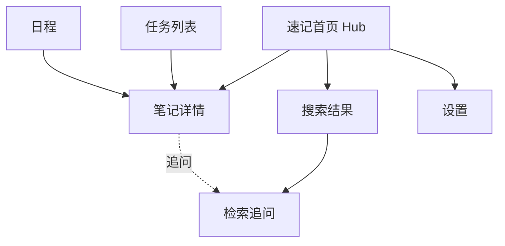

# Phase 2: Kite 信息架构

## 1. 页面清单

| ID | 页面 | 类型(22类) | 层级 | 说明 |
| --- | --- | --- | --- | --- |
| P01 | 速记首页 | Hub | 1 | 应用首屏，语音/文字速记 + 时间线 |
| P02 | 笔记详情 | Detail | 2 | 单条笔记，含来源/追问 |
| P03 | 任务列表 | List | 1 | 待办，按紧急/时间 |
| P04 | 日程 | List | 1 | 日历视图 |
| P05 | 搜索结果 | Search | 2 | 自然语言检索结果 |
| P06 | 检索追问 | Result | 2 | 基于结果的对话追问 |
| P07 | 设置 | Settings | 2 | 同步/导出/隐私 |

> 不存在的类型（Auth/Onboarding/Wizard 等）：M0 单用户、无登录，暂不需要；后续按需补。

## 2. Sitemap

## 3. 导航结构

底部 Tab（3 个，速记优先）：
- **速记**（P01，默认）
- **任务**（P03）
- **日程**（P04）

非 Tab 入口（P01 顶部）：搜索框、设置。 符合「捕获优先」——语音按钮在速记 Tab 最显眼。
