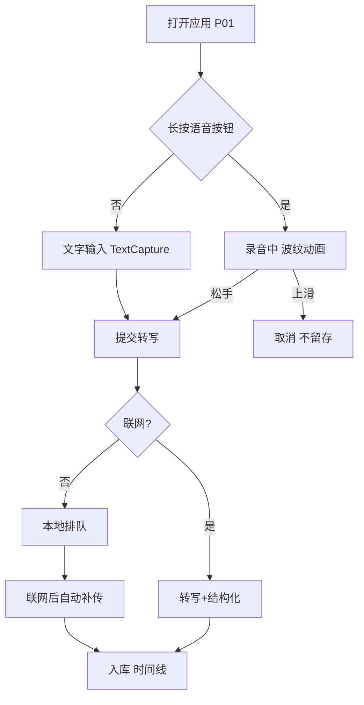
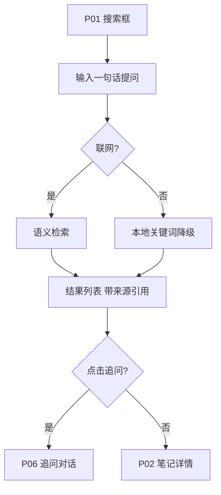

# Phase 3: Kite 用户流

## 流 1：语音速记（核心任务）

### Step Table
| 步骤 | 动作 | 页面状态 | 预估耗时 |
| --- | --- | --- | --- |
| 1 | 长按语音按钮 | 录音中（波纹） | 1s（触发） |
| 2 | 松手 | 转写中（骨架屏） | 2-3s |
| 3 | 转写完成 | 入库（时间线新增） | — |

## 流 2：检索与追问

## 关键决策点

| 决策点 | 条件 | 分支 |
| --- | --- | --- |
| DP1 联网状态 | 离线 | 速记走排队（REQ-CAP-VOICE-OFFLINE）；检索降级关键词 |
| DP2 麦克风权限 | 未授权 | 引导去设置（P07），不静默失败 |
| DP3 模型就绪 | whisper 未下载 | 录音排队，联网补模型再转写 |
